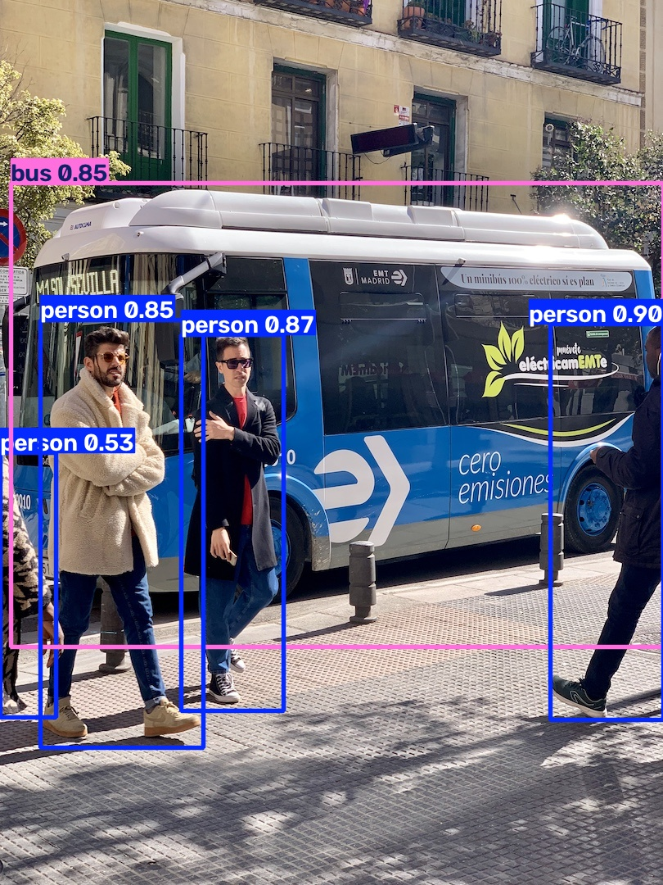

# Learning Notes

>华南理工大学软件学院 2025 级本科生
>
>记录从 Python/NumPy/OpenCV/PyTorch 到简单视觉模型训练、再到目标检测推理工具链的学习过程，以及Git/Linux/tmux/wandb等实验工程工具的简短熟悉。

## 仓库说明

本仓库记录从零开始学习计算机视觉与深度学习基础工具链的过程：Python 与数值计算基础、图像读取与预处理、PyTorch 模型训练流程，以及基于已有 YOLOv5 模型做目标检测推理的操作记录。包含基础脚本与一次真实推理流程记录。

## 环境依赖

```bash
pip install numpy opencv-python torch torchvision matplotlib -i https://pypi.tuna.tsinghua.edu.cn/simple
```
Python 3.9+ 推荐。

## 基础学习脚本

| 文件 | 内容 |
|---|---|
| 01_python_basics.py | 变量、列表/字典、循环、函数、文件读写、异常处理 |
| 02_numpy_demo.py | 数组创建、reshape、切片、运算、矩阵乘法、统计 |
| 03_opencv_demo.py | 图像读取、灰度化、resize、ROI 裁剪与保存 |
| 04_pytorch_concepts.py | Tensor 创建 + nn.Module 模型构建 + DataLoader 使用 |
| 05_pytorch_mnist.py | MNIST 手写数字分类训练（3 Epoch，支持 GPU） |
| 06_pytorch_fashion-mnist.py | Fashion-MNIST 数据集训练 |
| 07_pytorch_mnist_CNN.ipynb | 基于 CNN 的手写数字识别（Jupyter Notebook） |

## 运行方式

```bash
python 01_python_basics.py
python 02_numpy_demo.py
python 03_opencv_demo.py # 需在同目录放一张 test.jpg
python 04_pytorch_concepts.py
python 05_pytorch_mnist.py
python 06_pytorch_fashion-mnist.py  
# 07_pytorch_mnist_CNN.ipynb 在 Jupyter Notebook 或 JupyterLab 中打开运行
```

## 应用延伸：基于 YOLOv5 的目标检测推理

使用 Ultralytics YOLOv5 作为现成检测模型，验证本机 GPU / CUDA 环境，跑通图片、视频和摄像头检测流程。暂时未训练自定义模型，主要是熟悉工具链操作。

### 环境配置

| 项目 | 配置 |
| --- | --- |
| GPU | NVIDIA GeForce RTX 5060 (8GB), Windows + WSL2 |
| CUDA Driver | 13.1 |
| PyTorch | CUDA enabled (cu129) |
| 环境管理 | WSL2 Ubuntu, python3-venv (~/venv) |

### 流程记录

1. 创建 conda 环境并安装 PyTorch CUDA 版  
2. 克隆 YOLOv5 仓库，手动下载权重 yolov5s.pt  
3. 安装依赖并解决网络/路径问题  
4. 跑通图片推理 → 视频检测 → 摄像头实时检测
5. 对比 --conf 0.25/0.5 与 --img 320/640 的输出差异

### 推理命令

```bash
图片检测：
python detect.py --source data/images/bus.jpg --weights yolov5s.pt
视频检测：
python detect.py --source videos/test.mp4 --weights yolov5s.pt
摄像头实时检测：
python detect.py --source 0 --weights yolov5s.pt
```

### 参数对比

| 参数 | 设置 | 观察结果 |
| --- | --- | --- |
| `--conf` | 0.25 / 0.5 | 阈值越低框越多，越高框越严 |
| `--img` | 320 / 640 | 尺寸越小越快，小目标可能漏检 |

### 检测结果示例



## 学习状态

- [x] Python 基础语法
- [x] NumPy 数组操作
- [x] OpenCV 图像读取与预处理
- [x] PyTorch 训练流程（MNIST / Fashion-MNIST / CNN）
- [x] 本机 GPU / CUDA 与 WSL2 + venv 环境配置
- [x] 使用 YOLOv5 跑通目标检测推理（图片 / 视频 / 摄像头）
- [x] YOLOv5 参数对比（conf / img-size）
- [x] wandb / tmux / Git / Linux 简单练习
- [ ] 后续：进组后根据组里需要深入学习

## 联系方式

邮箱：202530550112@mail.scut.edu.cn
